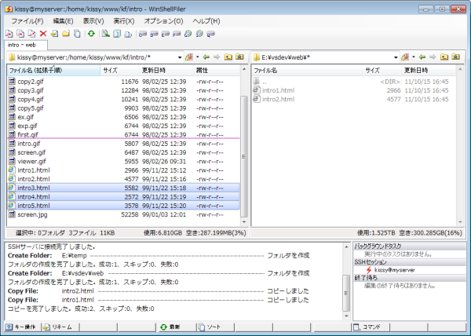

# ShellFilerの紹介

ShellFilerはDOS時代の2画面ファイラーの流れを引き継いだWindows用のファイル管理ソフトです。

ファイル一覧の左右はどちらも対等で、転送元と転送先を表します。ファイルのコピーや移動はカーソルのある側から反対側に（右から左に、または、左から右に）転送します。

転送元と転送先が常に表示されているため、コピー先を見失うこともありません。

ファイルビューアの起動や名前の変更など、転送とは関係のない操作は左右のどちらでも実行できます。

**注目の機能**

* [充実のファイル操作](file/file.md)

* [圧縮ファイルの操作](archive/archive.md)

* [軽快なファイルビューア](fileviewer/fileviewer.md)

* [統合されたグラフィックビューア](graphicsviewer/graphicsviewer.md)

* [SFTPサーバへのシームレスなアクセス](sftp/sftp.md)

* [SSHコンソールをGUIで操作](ssh/ssh.md)

* [開発者向けの機能](developer/developer.md)
