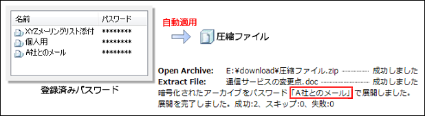
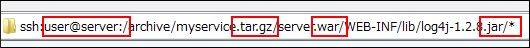
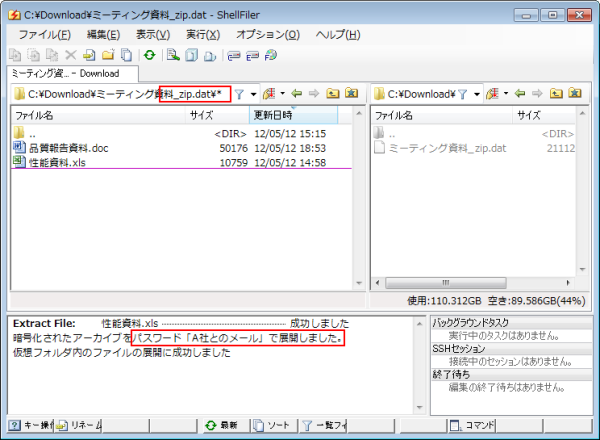

# 圧縮ファイルの操作

ShellFilerをインストールした後、別途 [7-Zip](http://sevenzip.sourceforge.jp/)をインストールすることで、7-ZipのDLLを使って圧縮や展開を行うことができます。

さらに、SSHサーバーにあるファイルをリモートコマンドで圧縮できます（自動的にローカルにダウンロードして展開することもできます）。

## 対応形式

ShellFilerが対応している形式は以下の通りです。

**Windows上(7-Zipを利用)**

* 圧縮：7z、tar.gz、tar.bz2、tar、zip
* 展開：7z、tar.gz、tar.bz2、tar、zip（jarやwarを含む）、arj、cab、iso、lzh、rar

**SSHサーバー上**
* 圧縮：tar.gz、tar.bz2、tar、zip
* 展開：非対応（一度ローカルにダウンロードして展開）

## パスワード入力の自動化

暗号化された書庫に対して、事前に登録しておいたパスワードを自動入力できます。

暗号化された書庫ファイルを展開するとき、登録済みのパスワードを順番に適用します。適用されたパスワードの種類は、展開終了後、ログ画面に表示されます。

また、クリップボードに入っている文字列をパスワードと見なして自動的に適用してみる機能も実現しています。

## 仮想フォルダで圧縮ファイルを閲覧

ShellFilerには、Zipやtarなどのアーカイブファイルを1つのフォルダのように表示する「仮想フォルダ」の機能を搭載しています。

Zipファイル上でEnterを押すと、その内容がフォルダのように表示され、閲覧や実行ができます。

**特徴**

* Windows上はもちろん、SSHのアーカイブファイルも仮想フォルダで表示できます。SSHの場合は元のアーカイブファイルが一度作業フォルダにダウンロードされます。

* 2重、3重に圧縮されているファイルも順にたどることができます。
  深い階層のアドレスを指定すると、ダウンロードや複数回の展開が自動的に行われます。SSHサーバにアップロードされたtar.gz内にwarファイルがあり、そのライブラリ（jarファイル）内の構成ファイル一覧も即座に確認できます。
  

* 仮想フォルダ内では、ファイルコピーのような感覚で必要なファイルだけを展開できます。

なお、アーカイブファイルを更新する機能は実現していません。仮想フォルダをコピー先に指定したり、フォルダの作成などの書き込み操作を行うとエラーになります。

## 内容の自動判別

一覧で`U`キーを押すと、そのファイルを圧縮ファイルとみなして内容を自動判別し、仮想フォルダとして開くことができます。

パスワードの自動入力機能を組み合わせると、拡張子が化けた暗号化zipであっても、何事もなく確認できます。

[<<前へ](../file/file.md) | [次へ>>](../fileviewer/fileviewer.md) | [戻る](../README.md)
