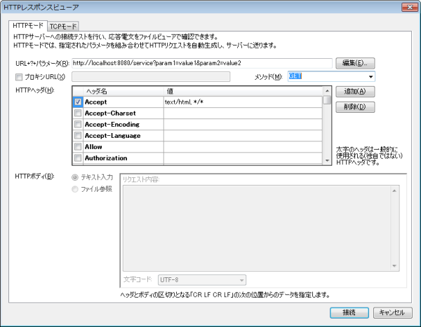
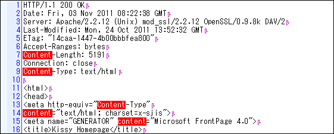
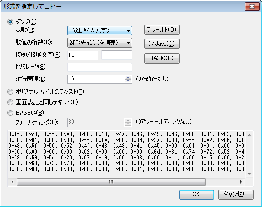

# 開発者向けの機能

ShellFilerでは、開発作業で重宝すると思われる機能をいくつか搭載しています。

## HTMLレスポンスビューア

HTMLレスポンスビューアは、ネットワーク系の開発を行うときに便利な機能です。

HTTPサーバに対して自由なパラメータでリクエストを送信し、戻り電文をファイルビューアで確認できます。

Webブラウザでは、結果が表示されるまでにキャッシュや整形などの様々な影響を受けるため、正しく表示できないことがあります。HTTPレスポンスビューアでは生の通信データを直接確認することができます。

もちろん、ビューアの検索や文字コード指定の機能はそのままですので、ShellFilerをリッチなUIを持ったテスト用簡易クライアントとして使用することができます。





## ダンプ形式への整形機能

任意のファイルをShellFilerのダンプビューアと同じ形式に加工できます。

レポートの作成作業などで、バイナリデータの解析結果をメールやドキュメントに貼り付けたい場合があります。

ShellFilerの機能を使えば、指定したファイルを以下のようなテキスト文字列に変換できます。

※`実行`メニューの`マークファイルをテキスト変換`から実行できます。

```
FF D8 FF E0 00 10 4A 46 - 49 46 00 01 02 00 00 01  | ......JFIF......
00 01 00 00 FF FE 00 04 - 2A 00 FF E2 0B F8 49 43  | ........*.....IC
43 5F 50 52 4F 46 49 4C - 45 00 01 01 00 00 0B E8  | C_PROFILE.......
00 00 00 00 02 00 00 00 - 6D 6E 74 72 52 47 42 20  | ........mntrRGB 
58 59 5A 20 07 D9 00 03 - 00 1B 00 15 00 24 00 1F  | XYZ .........$..
61 63 73 70 00 00 00 00 - 00 00 00 00 00 00 00 00  | acsp............
00 00 00 00 00 00 00 01 - 00 00 00 00 00 00 00 00  | ................
00 00 F6 D6 00 01 00 00 - 00 00 D3 2D 00 00 00 00  | ...........-....
```

## ダンプビューアからソースコードを生成

上記と同様に、ダンプビューアで選択された範囲をソースコードの形式に整形することができます。

ダンプビューアの`形式を指定してコピー`を使うと、選択した範囲のバイト列を以下のようなソースコードの形式に変換してクリップボードにコピーすることができます。



```
0xff, 0xd8, 0xff, 0xe0, 0x00, 0x10, 0x4a, 0x46, 0x49, 0x46, 0x00, 0x01, 0x02, 0x00, 0x00, 0x01
0x00, 0x01, 0x00, 0x00, 0xff, 0xfe, 0x00, 0x04, 0x2a, 0x00, 0xff, 0xe2, 0x0b, 0xf8, 0x49, 0x43
0x43, 0x5f, 0x50, 0x52, 0x4f, 0x46, 0x49, 0x4c, 0x45, 0x00, 0x01, 0x01, 0x00, 0x00, 0x0b, 0xe8
0x00, 0x00, 0x00, 0x00, 0x02, 0x00, 0x00, 0x00, 0x6d, 0x6e, 0x74, 0x72, 0x52, 0x47, 0x42, 0x20
0x58, 0x59, 0x5a, 0x20, 0x07, 0xd9, 0x00, 0x03, 0x00, 0x1b, 0x00, 0x15, 0x00, 0x24, 0x00, 0x1f
```

[<<前へ](../ssh/ssh.md) | [戻る](../README.md)
