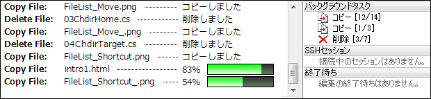
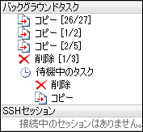
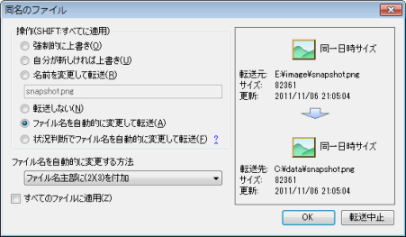
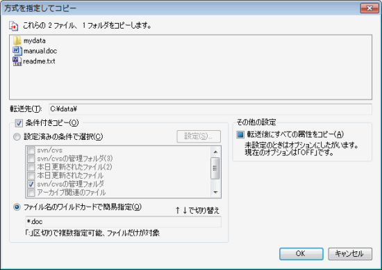
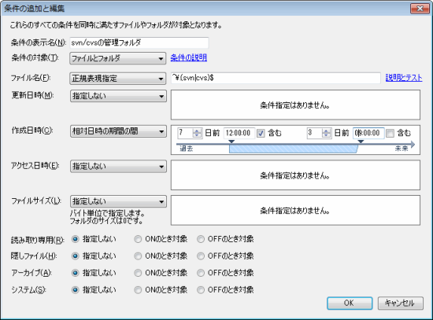
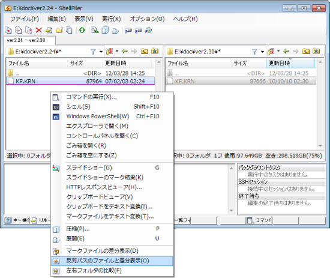

# 充実のファイル操作

ShellFilerでは、ファイル管理ソフトの基本となるコピー、移動、削除などの機能も高機能です。いくつかの機能をご紹介します。

## ファイル操作の並列化

ファイルのコピーなどの時間がかかる処理は、マルチスレッドで複数実行できます。
処理を開始するとバックグラウンドで処理が行われるため、即座に別の作業を行うことができます。

たとえば、コピーを開始した直後に、別フォルダにあるファイルを削除するような使い方もできます（もちろん、コピーの転送元ファイルを処理前に削除したりすると、転送は失敗します）。

ファイル操作は4つまで同時に起動することができます。それ以上のファイル操作を開始すると、新しい操作は待ち行列上で待機状態となります。
実行していた処理が終わると、待機状態の処理が自動的に開始されます。

## 同名のファイル

コピーや移動で同じ名前のファイルが見つかったときの操作をファイル単位で指定することができます。

上書き、スキップ、名前の変更などをファイルごと、または、一括で指定することができます。

`状況判断でファイル名を自動的に変更して転送`の機能は、Webからダウンロードしたファイルを整理するときに便利です。

* ファイルサイズが同じとき → 転送はスキップされます。

* ファイルサイズが違うとき → 自動的に`filename(2).dat` `filename(3).dat`…などにリネームして転送されます。

ファイルの移動でこのモードを選択すると、同じファイルを2回ダウンロードした場合に転送されないため、簡易的なファイルの重複防止策として役立ちます。

## 条件付きコピー

コピー、移動、削除には詳細モードがあります。

詳細モードでは、特定の条件に一致するファイルやフォルダだけを処理対象にすることができます。

条件の指定では、ファイル名の一致を正規表現で指定できるほか、ファイルの日付や属性など、きめ細かな条件が指定できます。また、簡易的にワイルドカードだけを指定して、`*.doc`だけを転送するという指定もできます。

たとえば、subversionでは、リポジトリからダウンロードしたフォルダすべてに`.svn`という管理フォルダができますが、この機能を使えば管理フォルダだけを移動したり、削除したりできます。
以下は、正規表現`^\.(svn|cvs)$`にヒットするファイルを操作する例です。

## 差分表示ツールとの連携

[WinMerge](http://winmerge.org/)などの差分表示ツールを設定すると、ShellFilerから簡単に差分表示を行うことができます。

左右の画面で1つずつファイルをマークして`反対パスのファイルと差分表示`を実行すると、ファイルの差分を差分表示ツールで表示できます。

本来は差分表示ツールを起動して、目的のファイルをたどって…という煩雑な操作が必要ですが、ShellFilerなら画面上で一発起動できます。

[次へ>>](../archive/archive.md) | [戻る](../README.md)
