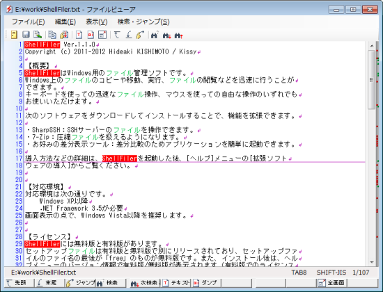
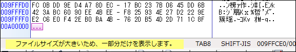
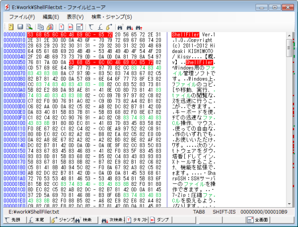
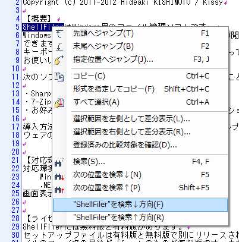
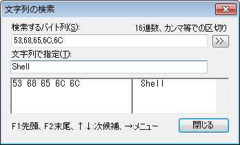

# 軽快なファイルビューア

ShellFilerは内蔵のテキストファイルビューアを搭載しています。

関連付け実行によって外部のビューアやエディタを使用することもできますが、内蔵ビューアを使用すると、より軽快で安定した操作ができます。

## 安定した表示特性

巨大なファイルを開いても安定した性能を出せるよう、内蔵ファイルビューアではデフォルトで先頭の10MBだけを読み込みます。

また、並列処理で読み込んだ部分から、順次、表示が始まります。

文字コードはSHIFT-JIS、EUC-JP、JIS、UTF-8、UNICODEに対応しており、途中で切り替えることができるため、未知のファイルも戸惑うことなく読み込むことができます。

## バイナリ表示にも対応

ファイルをバイナリダンプ形式で表示することもできます。

ダンプ表示でも、テキスト部分の文字コードの変更、インクリメンタルサーチやマウスクリックによる検索など、軽快な操作はそのままです。

## 便利な検索機能

ファイルビューアでは、様々な方法で文字列を検索できます。

* インクリメンタルサーチで検索できます。
  検索キーワードを入力すると、入力に伴って自動的に検索結果を表示します。
  ダンプビューアでは16進数のコードでも文字列でも検索できます。

  

* マウスクリックによる検索
  マウスをクリックした周辺の文字列をキーワードとして自動抽出して検索できます。
  プログラミング環境でおなじみの機能をテキストファイルで実現しました。

  

## テキスト内の差分表示

ファイル内でも差分が簡単に取れます。

範囲選択後に右クリックして、`選択範囲を左側として差分表示`と`選択範囲を右側として差分表示`をそれぞれ実行すると、指定した範囲同士でのテキストの差分情報が表示されます。

同じテキスト内でコピー＆ペーストによって作成した部分が同一かどうかを調べるのに便利です。

[<<前へ](../archive/archive.md) | [次へ>>](../graphicsviewer/graphicsviewer.md) | [戻る](../README.md)
