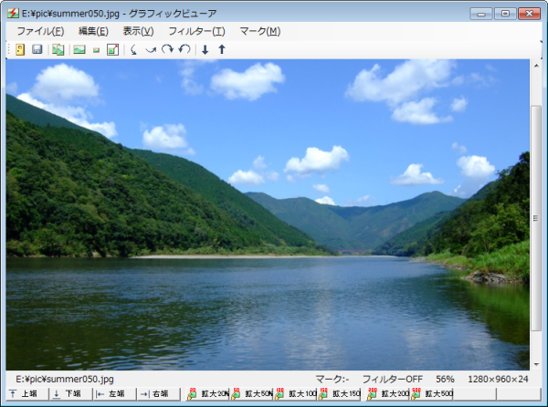
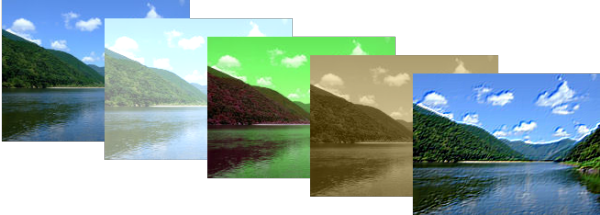

# 統合されたグラフィックビューア

よく使う画像ファイル（bmp/jpg/png/gif）は内蔵グラフィックビューアで即座に表示できます。スクロール、ズーム、反転/回転表示もサポートしています。

画像を表示するだけでなく、ファイラーと統合されているため、効率よく画像を整理する機能も用意しています。

## フィルター機能

明るさや色調の調整などの簡単なフィルターを持っています。

レタッチツールを起動しなくても、撮影した写真を簡易的に加工することができます。

**サポートしているフィルター**

* 明るさ/コントラスト/ガンマ
* 色相/彩度/明度
* シャープ
* ぼかし
* モノクロ
* ネガティブ
* セピア
* カラーレリーフ

## スライドショー

スライドショーモードでは、フォルダ内で読み込める画像を連続して表示させることができます。

グラフィックビューアを起動後、`G`キーを押したり、ツールバーの「↑」「↓」ボタンを押したりすると、すぐにスライドショーモードに切り替えることができます。

スライドショーでは、画像の表示中にもマルチスレッドで次の画像を用意するため、軽快な表示を行うことができます。

## スライドショーとファイル操作の連携

グラフィックビューアは、ファイラーと統合されているため、スライドショーで分類したファイルを効率よく整理することができます。

画像の表示中にフルキーの「1」〜「9」を押すと、各画像ごとにマークNo.1〜No.9が記憶されます。終了後、ファイル一覧からマークNo単位でファイルを選択して、移動や削除などの希望の操作を実行できます。

[<<前へ](../fileviewer/fileviewer.md) | [次へ>>](../sftp/sftp.md) | [戻る](../README.md)
