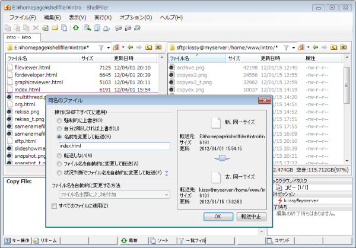
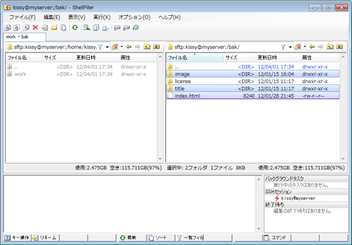
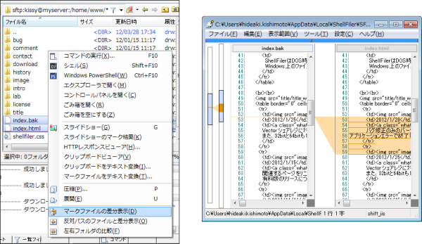

# SFTPサーバへのシームレスなアクセス

ShellFilerはSFTPクライアントの機能を持っています。

[SharpSSH](https://ja.osdn.net/projects/sfnet_sharpssh/)をインストールすると、LinuxなどのSSH（SFTP）サーバーにあるファイルをWindowsのファイルと同様に操作することができます。

**SFTPとは**

SFTPは、SSHプロトコルの上で動作するファイル転送プロトコルです。
FTPプロトコルとは名前が似ていますが、内容は異なるため、ShellFilerをFTPクライアントとして使用することはできません。

## 自由な組み合わせ

通常、2画面構成のクライアントソフトでは、左側がローカル、右側がリモートとなるのが定番ですが、ShellFilerでは、左右を逆にしたり、両方をリモートにしたりすることもできます。

ファイルの転送時は、実行する状況に応じて必要な処理を自動的に判断します。

* ローカル→ローカル：Windowsのファイル転送
* ローカル→リモート：SFTPのputコマンドでの転送
* リモート→ローカル：SFTPのgetコマンドでの転送
* リモート→リモート（同じログイン先）：SSHのcpコマンドでの転送
* リモート→リモート（異なるログイン先）：SFTPのgetコマンドでダウンロード後、putコマンドでアップロード

## 操作の例

2つある画面にローカルPCとリモートサーバーを表示させれば、ファイルのコピーを行うだけでサーバーへアップロードできます。

アップロード中、転送先に同名のファイルが見つかったときは、ローカルの場合と同じ画面が表示されます。その他、条件付きコピーなどもローカルと同様に使えます。

さらにリモート同士でコピーすることもできます。

例えば、次の画面ではマークディレクトリ「image」「title」にcp -rコマンド、マークファイル「index.html」にcpコマンドを自動的に発行します。

CUIで選択的なファイル操作を行うのは大変でしたが、ShellFilerからはローカルと同じ感覚で簡単に操作できます。

## ローカルもリモートも同じように

ShellFilerのファイルシステムはWindows/SFTPを問わず、内部が仮想化されているため、多くの処理ではローカルとリモートの区別がありません。

たとえば、リモート同士やローカルとリモートの間で即座にテキストの差分を確認したり、SFTPサーバにあるファイルでスライドショーを実行したりすることもできます。

※以下はFrozenさん作の差分表示ツールを起動させる実行例です。

[<<前へ](../graphicsviewer/graphicsviewer.md) | [次へ>>](../ssh/ssh.md) | [戻る](../README.md)
