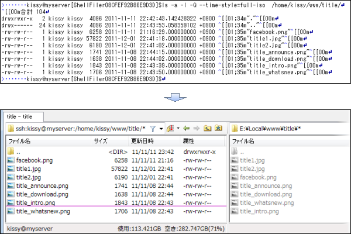
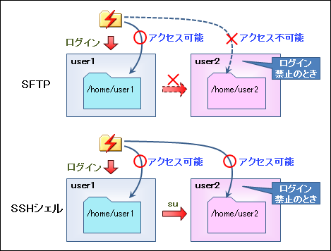

# SSHコンソールをGUIで操作

ShellFilerは、SSHのターミナル画面（CUI）をファイル一覧のGUIで操作できる機能（「SSHシェル」での接続機能）を持っています。

SSHシェル接続を行うと、画面上はWindowsやSFTPのファイル一覧と同じような内容が表示されますが、その裏ではターミナルと同じSSHのシェルチャネルが動いています。
GUIの機能に応じて、複雑なオプションが設定されたコマンドが自動的に入力され、結果の文字列を解析/抽出してGUIに反映します。

例えば、ファイル一覧を出力するためには`ls -a -l -Q --time-style=full-iso`コマンドを入力し、結果の一覧からエスケープシーケンスの除去後に文字列を切り出してGUIに反映してます。

## suでのユーザー切り替え

ShellFilerでSSHシェルの方式を使う目的は、suコマンドによるユーザー切り替えに対応するためです。

SSHサーバーの運用では、ターミナルから自分のユーザーでログインした後、suコマンドによって共通ユーザー（サービスプロセスの実行ユーザーやDB操作ユーザーなど）に切り替えて操作することが多くあります。作業中にrootで操作したいこともあります。

SFTPではsuコマンドをサポートしていないため、はじめにログインしたユーザーでしかファイル操作を行うことができません。
一方、SSHシェル接続では、ターミナルからの作業と実質的に同じことができるため、ユーザーの切り替えにも対応しています（`SSH-ユーザーの切り替え`で切り替えられます）。

## ファイル転送のサポート

SSHシェル接続を実現する内部処理はターミナル機能そのものですが、ShellFilerではファイルのアップロードとダウンロードもサポートしています。

* アップロード
  Linuxのヒアドキュメントを使ってファイルをアップロードします。猛烈な速度でファイル内容のダンプを入力しているイメージです。ただし、性能は出ないため、実質的に1MB以上のファイルは扱えません。

* ダウンロード
  catコマンドの実行後、ローカルでCR/LFの変換を行います。バイナリファイルをコンソール画面に出力して、ログファイルを整形するイメージです。

内部でもファイルの転送をサポートしているため、SSHシェル接続のフォルダでもShellFilerの機能を一通り使えます。
たとえば、SSHサーバー上にあるjarファイル内の画像をスライドショーで確認するには、SSHサーバーにログイン後、ローカルと同じくjarファイルから仮想フォルダに入るだけです。
裏ではcatコマンドの実行と必要なCR/LF変換を行ってローカルにアーカイブファイルを用意した後、7-ZipのDLLを使って内容を解析/展開してスライドショーを実行します。

**ご注意**

ファイルのアップロード時の変換機能として、vimに付属のxxdコマンドが必要です。あらかじめ接続先のサーバーにインストールしてPATHを通しておく必要があります。

[<<前へ](../sftp/sftp.md) | [次へ>>](../developer/developer.md) | [戻る](../README.md)
